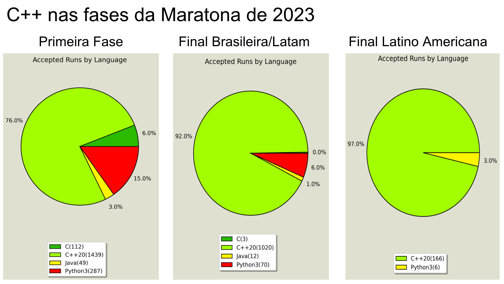

# ⚙️ Por que usar C++?

C++ é uma ótima linguagem para competições de programação, pela sua alta velocidade de execução e funções e estruturas pré-definidas na sua biblioteca padrão.

Também, ela é a linguagem mais utilizada nas fases mais avançadas das competições, como a Maratona de Programação da SBC e a ICPC:

<figure><figcaption></figcaption></figure>

# ⚙️ Conteúdo

0. [Complexidade](complexidade.md)
1. [Entradas e saídas](entradas_saidas.md)
2. [Conjuntos](conjuntos.md)
3. [Crivo de Erástotenes](crivo.md)
4. [Algoritmo de Euclides](euclides.md)
5. [Soma Máxima em um Intervalo](soma_max_intervalo.md)
6. [Busca Binária](busca_binaria.md)
7. [Manipulação de bits](bits.md)
8. [Algoritmo Guloso](guloso.md)
9. [Filas e Pilhas](filas_pilhas.md)
10. [Filas de prioridade](filas_prioridade.md)
11. [Grafos](grafos.md)
12. [Union-Find](union_find.md)
13. [Menor caminho - 1](menor_caminho_1.md)
14. [Menor caminho - 2](menor_caminho_2.md)
15. [Algoritmo de Kruskal](kruskal.md)
