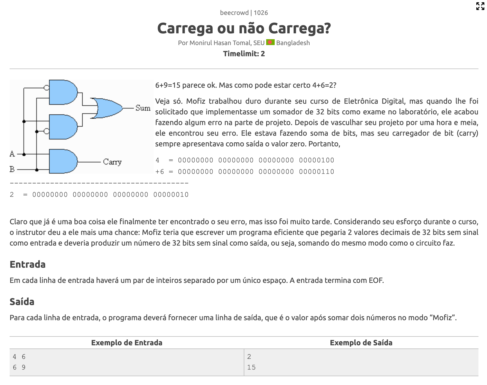

# Manipulação de bits

## 📚 Introdução

Todos os dados que são armazenados em um computador são representados por bits, que são 0s e 1s. Por exemplo, o número 5 é representado por 101 em binário, e o número 7 é representado por 111.

Em programação competitiva, existem alguns momentos em que se é vantajoso manipular diretamente os bits de um número, vamos ver algumas operações que podemos fazer com eles.

## 📌 Operadores binários

### Operador `|`

O operador `|` é o operador de ou, ou OR. Ele retorna 1 se pelo menos um dos bits for 1, e 0 caso contrário.

| Operação | Resultado |
| :------: | :-------: |
|  0 \| 0  |     0     |
|  0 \| 1  |     1     |
|  1 \| 0  |     1     |
|  1 \| 1  |     1     |

### Operador `^`

O operador `^` é o operador de ou exclusivo, ou XOR. Ele retorna 1 se os bits forem diferentes, e 0 se forem iguais.

| Operação | Resultado |
| :------: | :-------: |
|  0 ^ 0   |     0     |
|  0 ^ 1   |     1     |
|  1 ^ 0   |     1     |
|  1 ^ 1   |     0     |

### Operador `&`

O operador `&` é o operador de e, ou AND. Ele retorna 1 se os dois bits forem 1, e 0 caso contrário.

| Operação | Resultado |
| :------: | :-------: |
|  0 & 0   |     0     |
|  0 & 1   |     0     |
|  1 & 0   |     0     |
|  1 & 1   |     1     |

### Operador `~`

O operador `~` é o operador de negação, ou NOT. Ele inverte todos os bits.

| Operação | Resultado |
| :------: | :-------: |
|    ~0    |     1     |
|    ~1    |     0     |

### Operador `<<`

O operador `<<` é o operador de deslocamento à esquerda. Ele desloca todos os bits para a esquerda, e preenche os bits vazios com 0.

| Operação | Resultado |
| :------: | :-------: |
|  1 << 1  |     2     |
|  1 << 2  |     4     |
|  5 << 2  |    20     |

### Operador `>>`

O operador `>>` é o operador de deslocamento à direita. Ele desloca todos os bits para a direita, e preenche os bits vazios com 0.

| Operação | Resultado |
| :------: | :-------: |
|  1 >> 1  |     0     |
|  4 >> 1  |     2     |
|  5 >> 2  |     1     |

## Checar se um bit está ligado

Para checar se um bit é 1, podemos usar o operador `&` com uma máscara que tenha apenas o bit que queremos checar como 1.

Por exemplo, para checar se o terceiro bit de 5 é 1, podemos fazer:

```cpp
bool is_set(int x, int i){
  bool ret = (x & (1 << i)) != 0;
  return ret;
}

is_set(5, 2); // true (5 = 101 em binário)
```

## Retornar o bit menos significativo

Para calcular o negativo de um número basta inverter os bits e somar 1 a isso, dessa forma os `lsb` dos dois números são iguais, porém todos os bits maiores que o `lsb` deles serão diferentes, assim, basta retornamos o `and` dos bits entre o número e o negativo desse número.

```cpp
int lsb(int x){
  return x & -x;
}

lsb(5); // 1
```

## Contar o número de bits 1

Podemos usar a ideia do `lsb` para fazer esse cálculo mais rapidamente, usamos um loop, e enquanto o número for diferente de 0, subtraimos o `lsb` do número e adicionamos um a um contador, quando o loop termina retornamos o contador

```cpp
int count_bits(int x){
  int ret = 0;
  while(x != 0){
    ++ret;
    x -= x&-x;
  }
  return ret;
}

count_bits(5); // 2
```

## Checar se um número é potência de 2

Se o númerno não for 0, vemos se ele tem algum bit em comum com seu antecessor, pois se ele for uma potência de 2, digamos 2\*\*i, o único bit ligado será o i, enquanto seu antecessor tem todos os bits menores que i iguais a 1, assim o and deles será 0.

```cpp
bool is_power_of_two(int x){
  if(x == 0)  return 0;
  return ((x&(x - 1)) == 0);
}

is_power_of_two(5); // false
```

## Bits necessários para representar um número

Podemos checar quantos bits são necessários para representar um número usando o operador `>>` e um loop, enquanto o número for diferente de 0, deslocamos ele para a direita e adicionamos 1 a um contador, quando o loop termina retornamos o contador.

```cpp
int number_of_bits(int number) {
  int count = 0;
  while (number > 0) {
    number >>= 1;
    count++;
  }
  return count;
}

number_of_bits(5); // 3
```

## Ligar um bit

Para ligar um bit, basta usar o operador `|` com uma máscara que tenha apenas o bit que queremos ligar como 1.

Por exemplo, para ligar o segundo bit de 5 como 1, podemos fazer:

```cpp
int x = 5; // 101 em binário

x |= (1 << 1); // x = 7 (111 em binário)
```

## Desligar um bit

Primeiro garantimos que o bit está ligado, depois ele recebe ele mesmo `xor` a potência de 2 do bit que queremos desligar.

Por exemplo, para desligar o terceiro bit de 5, podemos fazer:

```cpp
int x = 5; // 101 em binário

x |= (1 << 2) // garantimos que o terceiro bit está ligado

x ^= (1 << 2) // x = 1 (001 em binário)
```

## 🚀 Demonstração

Falamos bastante sobre diversas operações diferentes que podem ser feitas com bits, mas como isso pode ser útil nos problemas? Vamos ver um exemplo, no exercício 1026 do Beecrowd:

<figure><figcaption></figcaption></figure>

Nesse exercício, temos que escrever um programa que soma da forma incorreta, assim como o circuito feito pelo Mofiz, note que, pelo exemplo de soma que ele deu, 0 + 0 = 0; 1 + 0 = 1 e 1 + 1 = 0. Isso é a mesma coisa que o operador `xor`! Então podemos fazer o seguinte código:

```cpp
#include <iostream>

using namespace std;

int main() {
  ios::sync_with_stdio(false); cin.tie(0);

  long int num1, num2;
  while (cin >> num1 >> num2) {
    cout << (num1 ^ num2) << "\n";
  }
}
```

E com isso resolvemos o problema de uma maneira extremamente simples!

## 🧑‍🏫 Exercícios

- Exercício [1026](https://www.beecrowd.com.br/judge/pt/problems/view/1026) do Beecrowd, tente reproduzir a solução que fizemos acima.

- Exercício [2544](https://www.beecrowd.com.br/judge/pt/problems/view/2544) do Beecrowd, também é um ótimo exercício para praticar manipulação de bits.

- Exercício [2091](https://www.beecrowd.com.br/judge/pt/problems/view/2290) do Beecrowd, é um pouco mais desafiante, mas mostra mais uma vez como a manipulação de bits pode ser útil.

- Exercício [2290](https://www.beecrowd.com.br/judge/pt/problems/view/2290) do Beecrowd, é uma versão um pouco mais difícil do exercício anterior.
