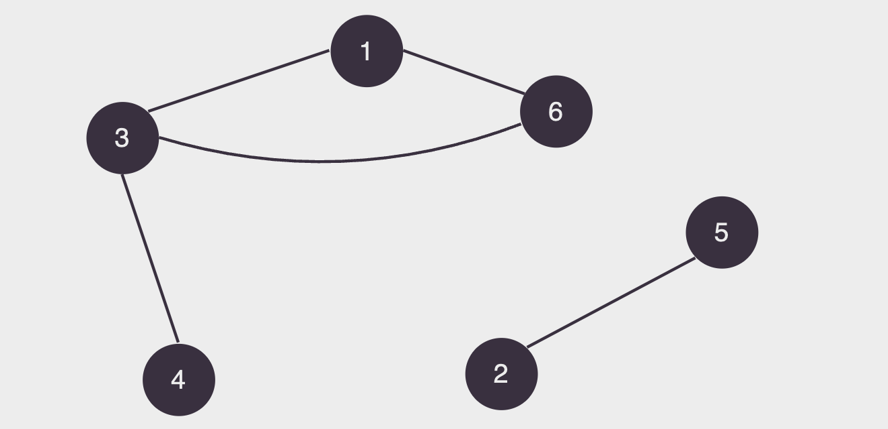
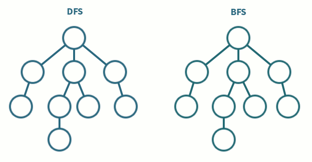

# Grafos

## 📚 Introdução

Um grafo é uma estrutura que consiste em um conjunto de pontos, chamados de vértices, e um conjunto de linhas que conectam esses vértices, chamadas de arestas. Em outras palavras, um grafo é uma representação visual de objetos (vértices) e suas conexões (arestas).

Essa estrutura é usada para modelar relações entre diferentes elementos, como redes de computadores, mapas de estradas, redes sociais e muito mais. Em um grafo, os vértices representam os pontos e as arestas representam as ligações entre esses pontos.

<figure><figcaption></figcaption></figure>

Existem diversos tipos de grafos, sendo os mais comuns:

- **Grafo direcionado**: um grafo onde as arestas possuem uma direção, ou seja, uma aresta do vértice `a` para o vértice `b` não implica que existe uma aresta do vértice `b` para o vértice `a`.
- **Grafo não direcionado**: um grafo onde as arestas não possuem uma direção, ou seja, uma aresta do vértice `a` para o vértice `b` implica que existe uma aresta do vértice `b` para o vértice `a`.

## 🔗 Representação de grafos

Uma ótima forma de representar grafos em C++ é usando listas de adjacência. Uma lista de adjacência é uma lista onde cada elemento representa um vértice e contém uma lista com os vértices adjacentes a ele.

O código fica mais ou menos assim:

```cpp
#include <vector>
#include <set>

using namespace std;

int n = 5; // número de vértices

// grafo com uma lista de adjacência para cada vértice
vector<set<int>> graph(n + 1);

// estabelecemos um caminho de mão dupla entre os vértices 1 e 2
graph[1].insert(2);
graph[2].insert(1);

// estabelecemos um caminho de mão única do vértice 3 para o vértice 4
graph[3].insert(4);
```

### 🧮 Busca em largura

A busca em largura (BFS - Breadth First Search) é um algoritmo de busca em grafos que explora os vértices de um grafo em camadas.

O algoritmo funciona da seguinte forma:

- Começamos a busca em um vértice inicial `s`, colocando-o em uma fila.
- Enquanto a fila não estiver vazia, retiramos um vértice da fila e exploramos todos os vértices adjacentes a ele.
- Se um vértice adjacente não foi visitado ainda, colocamos ele na fila e marcamos como visitado.

O algoritmo termina quando não há mais vértices na fila.

```cpp
#include <vector>
#include <queue>

using namespace std;

vector<vector<int>> graph;
int n;

void bfs(int s) {
    queue<int> fila;
    vector<bool> visitado(n + 1, false);

    fila.push(s);
    visitado[s] = true;

    while (!fila.empty()) {
        int vertice = fila.front();
        fila.pop();

        for (int vizinho : graph[vertice]) {
            if (!visitado[vizinho]) {
                visitado[vizinho] = true;
                fila.push(vizinho);
            }
        }
    }
}
```

### 🧮 Busca em profundidade

A busca em profundidade (DFS - Depth First Search) é um algoritmo de busca em grafos que explora o máximo possível de um grafo antes de voltar.

O algoritmo funciona da seguinte forma:

- Começamos a busca em um vértice inicial `s`, marcando-o como visitado.
- Para cada vértice adjacente a `s`, se ele não foi visitado ainda, visitamos ele e repetimos o processo recursivamente.

O algoritmo termina quando não há mais vértices adjacentes a `s` que não foram visitados ainda.

```cpp
#include <vector>
#include <stack>

using namespace std;

vector<vector<int>> graph;
int n;

void dfs(int s) {
    stack<int> pilha;
    vector<bool> visitado(n + 1, false);

    pilha.push(s);
    visitado[s] = true;

    while (!pilha.empty()) {
        int vertice = pilha.top();
        pilha.pop();

        for (int vizinho : graph[vertice]) {
            if (!visitado[vizinho]) {
                visitado[vizinho] = true;
                pilha.push(vizinho);
            }
        }
    }
}
```

### ⚔️ DFS vs BFS

Podemos ver a diferença entre os dois algoritmos no [gif abaixo](https://media.hackerearth.com/blog/wp-content/uploads/2015/05/dfsbfs_animation_final.gif):

<figure><figcaption></figcaption></figure>

Como podemos ver a DFS, explora o máximo possível de um caminho antes de voltar, enquanto a BFS explora em "camadas".

Geralmente o BFS é mais usado, em situações onde precisamos ver se dois vértices estão conectados, ou se conseguimos chegar de um vértice a outro.

Já a DFS é mais usada em situações onde precisamos explorar o máximo possível de um caminho, como em labirintos.

## 🧑‍🏫 Exercícios

- Exercício [1445](https://www.beecrowd.com.br/judge/pt/problems/view/1445) do Beecrowd, esse é um exercício que pode ser resolvido com o algoritmo de busca em largura.

- Exercício [2412](https://www.beecrowd.com.br/judge/pt/problems/view/2412) do Beecrowd, esse é um pouco mais complicado pois você precisa descobrir quais vértices se conectam com quais.
