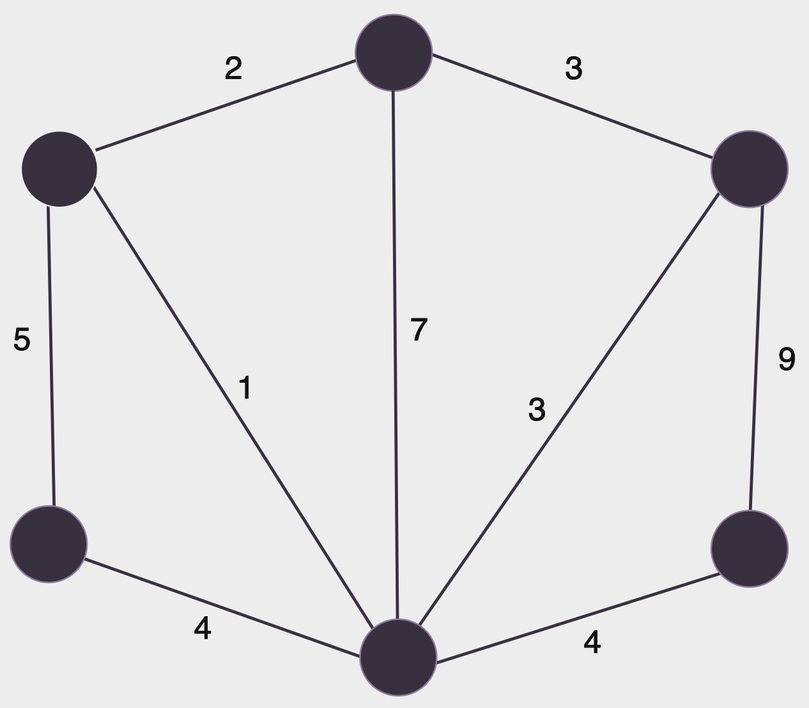
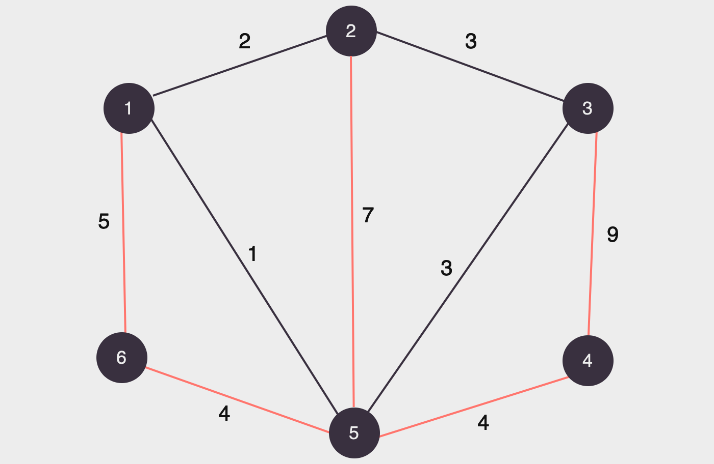
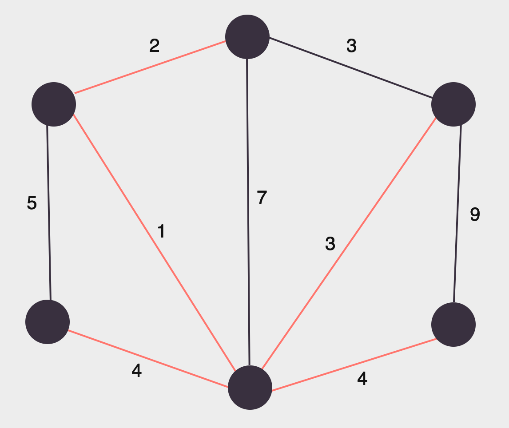
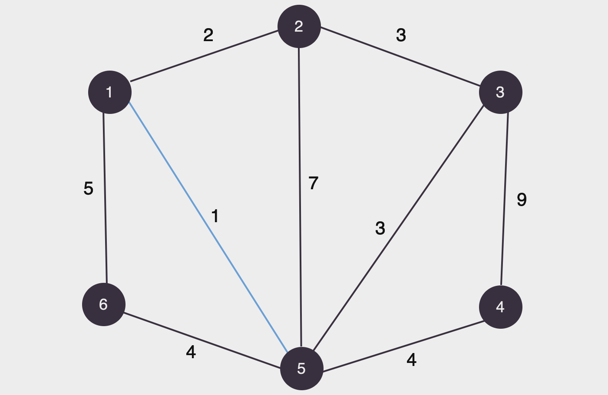
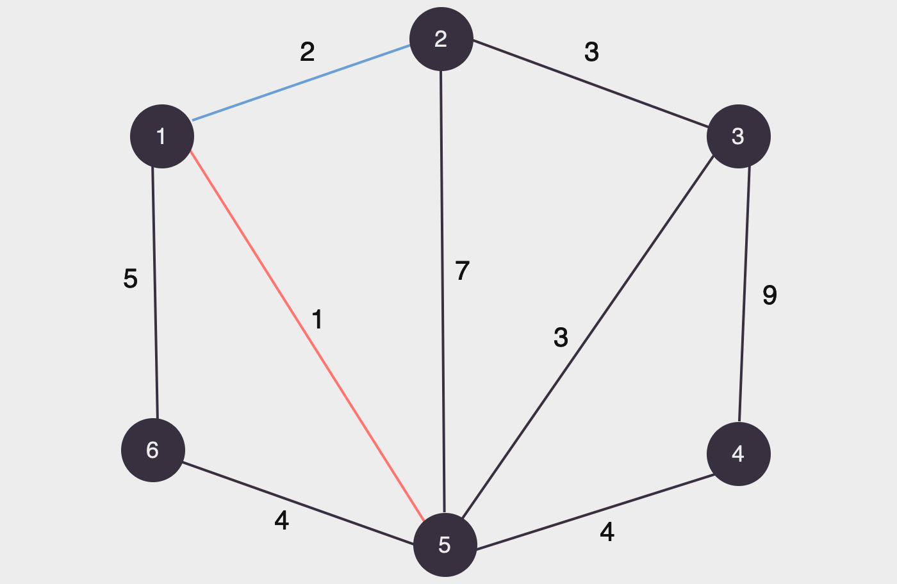
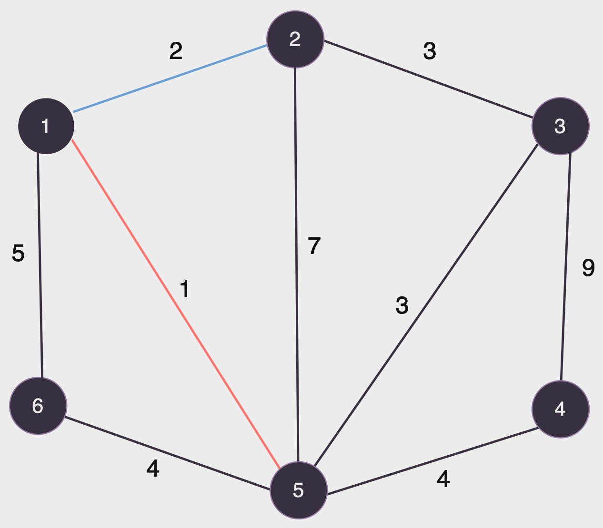
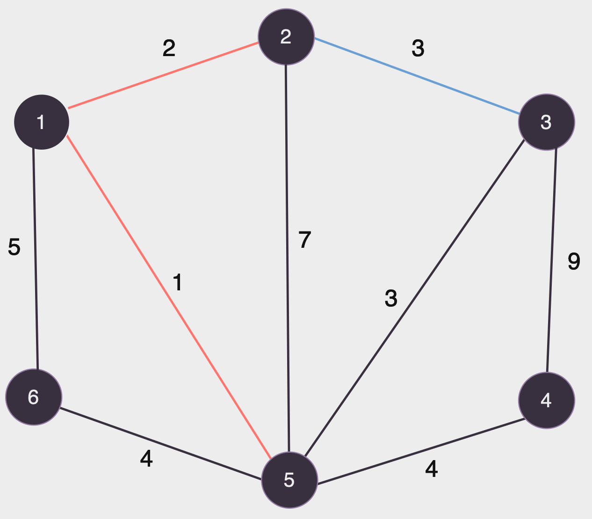
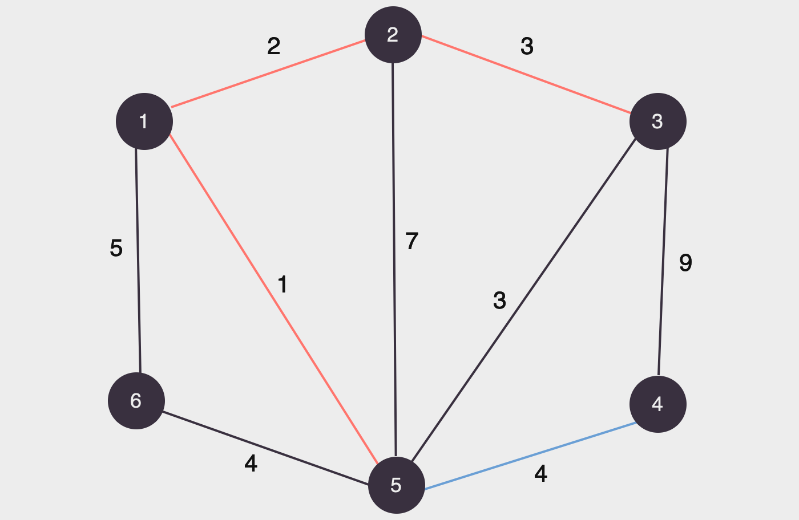
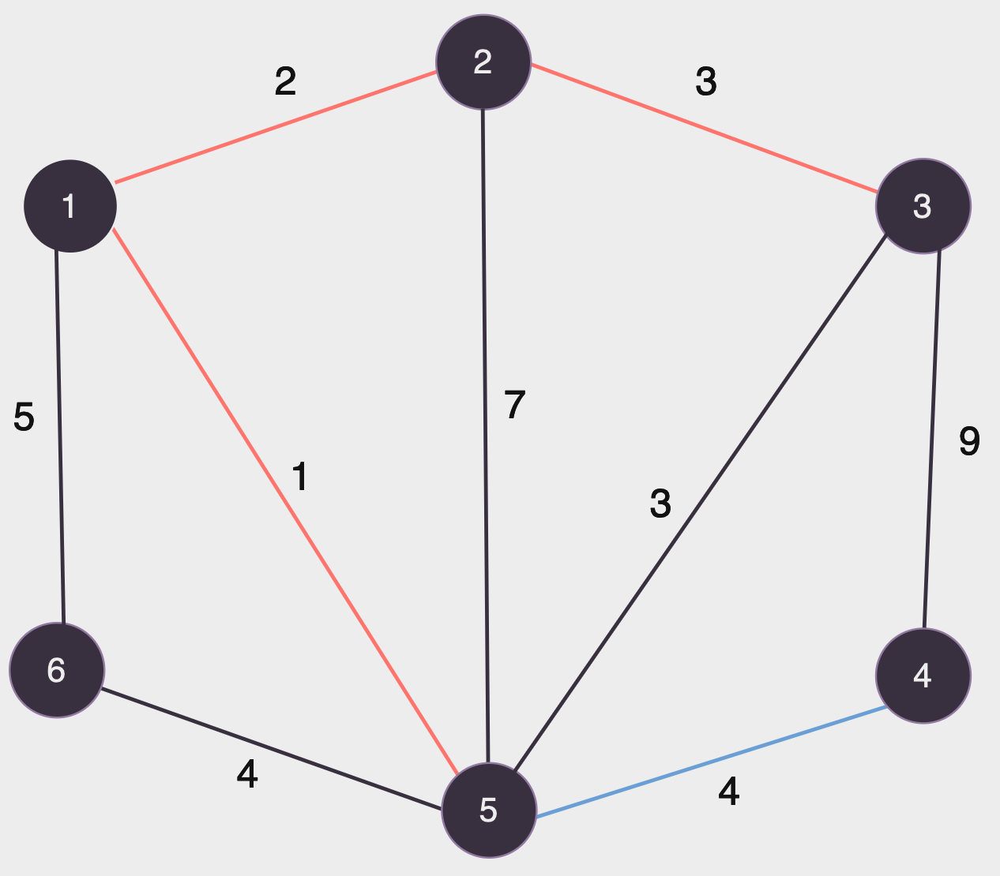
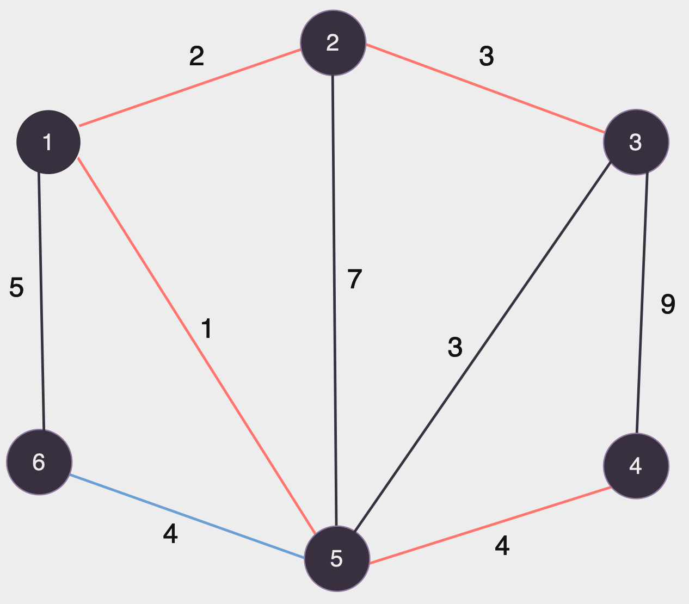

# Algoritmo de Kruskal

## 📚 Introdução

O estimado Dr. Kapi Vara da UFMS foi contratado para pavimentar as estradas do Mato Grosso do Sul, de forma que todas as cidades do estado sejam acessíveis por estradas pavimentadas. Ele sabe que o custo de pavimentação de uma estrada entre duas cidades é proporcional à distância entre elas. O Dr. Kapi Vara quer escolher as estradas de forma a ter o menor custo possível, mas ele não sabe por onde começar. Sabendo das suas habilidades em programação, ele pediu sua ajuda para resolver esse problema.

<!-- Adicione mais explicações sobre o conceito de árvore -->

Para resolver esse problema, podemos modelar as cidades como vértices e as estradas existentes como arestas de um grafo, o custo da pavimentação, seria o peso das nossas arestas. O problema, então, se torna encontrar a árvore geradora mínima (em inglês, Minimum Spanning Tree, MST) desse grafo, ou seja, a árvore que conecta todos os vértices com o menor custo (soma dos pesos) possível.

Vejamos o seguinte grafo:

<figure><figcaption></figcaption></figure>

Sabemos que, o menor número de arestas que precisamos ter para conectar todos os vértices de um grafo é o número de vértices - 1 (denotamos |V| - 1). No caso do grafo acima, precisamos de 5 arestas para conectar todos os vértices, existem várias formas de escolher essas arestas, vejamos duas delas:

<figure><figcaption></figcaption></figure>
<figure><figcaption></figcaption></figure>

Note que ambos exemplos são árvores geradoras do grafo, entretanto, a soma dos pesos das arestas da segunda árvore é consideravelmente menor, ela é um exemplo de árvore geradora mínima. Podem existir várias árvores geradoras mínimas para um grafo, mas todas elas terão o mesmo peso.

Existem dois algoritmos muito eficientes e conhecidos para resolver esse problema, o algoritmo de Kruskal e o algoritmo de Prim. Neste artigo, vamos focar no algoritmo de Kruskal.

## 🤷 Como funciona?

A ideia do algoritmo consiste em:

- Ordenar as arestas do grafo em ordem crescente de peso.
- Para cada aresta, se ela não forma um ciclo com as arestas já escolhidas, adicionamos ela à árvore geradora mínima.

Mas como verificar se uma aresta forma um ciclo com as arestas já escolhidas?

Para isso podemos utilizar a teoria dos conjuntos! Podemos representar cada vértice como um conjunto, e a cada aresta adicionada, unimos os conjuntos dos vértices que ela conecta. Se, ao tentar adicionar uma aresta, os vértices que ela conecta já estão no mesmo conjunto, então ela forma um ciclo.

Sendo assim, podemos utilizar um algoritmo que já vimos anteriormente, o algoritmo de [Union-Find](union_find.md), vamos lembrar também que esse algoritmo é muito eficiente (`O(log n)`), para verificar se uma aresta forma um ciclo.

Vamos entender melhor simulando o algoritmo de Kruskal no grafo visto acima, as arestas listadas em ordem crescente de peso são: (1, 5), (1, 2), (2, 3), (3, 5), (4, 5), (5, 6), (1, 6), (2, 5), (3, 4)

<figure><figcaption></figcaption></figure>

Começamos pela menor aresta, como os vértices 1 e 5 não estão no mesmo conjunto, adicionamos a aresta (1, 5) à árvore geradora mínima:

<figure><figcaption></figcaption></figure>

A próxima aresta é (1, 2), como os vértices 1 e 2 não estão no mesmo conjunto, adicionamos a aresta (1, 2) à árvore geradora mínima:

<figure><figcaption></figcaption></figure>

A próxima aresta é (2, 3), como os vértices 2 e 3 não estão no mesmo conjunto, adicionamos a aresta (2, 3) à árvore geradora mínima:

<figure><figcaption></figcaption></figure>

A próxima aresta é (3, 5), porém perceba que os vértices 3 e 5 estão no mesmo conjunto, então não podemos adicionar essa aresta, pois ela formaria um ciclo:

<figure><figcaption></figcaption></figure>

A próxima aresta é (4, 5), como os vértices 4 e 5 não estão no mesmo conjunto, adicionamos a aresta (4, 5) à árvore geradora mínima:

<figure><figcaption></figcaption></figure>

A próxima aresta é (5, 6), como os vértices 5 e 6 não estão no mesmo conjunto, adicionamos a aresta (5, 6) à árvore geradora mínima:

<figure><figcaption></figcaption></figure>

Como já selecionamos |V| - 1 arestas, podemos parar por aqui, finalmente, a árvore geradora mínima do grafo é:

<figure><figcaption></figcaption></figure>

Note que ela é diferente da árvore geradora mínima que mostramos anteriormente, mas ambas têm o mesmo peso total, que é 14.

Perceba também que esse algoritmo é eficiente, a complexidade dele é `O(M * log N)`, onde M é o número de arestas e N é o número de vértices e que ele implementa a ideia de um algoritmo guloso, já que ordenamos as arestas e só verificamos se podemos adicioná-las à árvore caso elas não formem um ciclo, sem fazer nenhuma verificação a mais, mas como sempre começamos pelas menores arestas, garantimos que a MST terá o menor peso possível.

## 📝 Implementação

Para implementar o algoritmo de Kruskal, vamos usar as ideias que discutimos anteriormente, implementamos o algoritmo do Union-Find, e ordenamos as arestas em ordem crescente de peso, feito isso, basta iterar sobre as arestas e verificar se elas fazem parte do mesmo conjunto. Vamos ver como fica a implementação em C++:

```cpp
#include <bits/stdc++.h>

using namespace std;

struct Aresta {
    int x, y, dist;

    bool operator<(const Aresta& other) const {
        return dist < other.dist;
    }
};

vector<int> pai, peso;

int find(int x) {
    // se x não é o patriarca
    if (x != pai[x])
        pai[x] = find(pai[x]);

    return pai[x];
}

void join(int x, int y) {
    x = find(x);
    y = find(y);

    // se x e y já pertencem ao mesmo conjunto
    if (x == y)
        return;

    // une pelo rank (peso)
    if (peso[x] < peso[y]) {
        pai[x] = y;
    } else if (peso[x] > peso[y]) {
        pai[y] = x;
    } else {
        pai[x] = y;
        peso[y]++;
    }
}

vector<Aresta> kruskal(vector<Aresta>& arestas) {
    sort(arestas.begin(), arestas.end());

    vector<Aresta> mst;

    for (auto aresta : arestas) {
        if (find(aresta.x) != find(aresta.y)) {
            mst.push_back(aresta);
            join(aresta.x, aresta.y);
        }
    }

    return mst;
}

int main() {
    int n, m;
    cin >> n >> m;

    pai.resize(n + 1);
    peso.assign(n + 1, 0);

    // inicialmente, cada vértice é pai de si mesmo
    for (int i = 1; i <= n; i++)
        pai[i] = i;

    vector<Aresta> arestas(m);

    for (int i = 0; i < m; i++) {
        cin >> arestas[i].x >> arestas[i].y >> arestas[i].dist;
    }

    vector<Aresta> mst = kruskal(arestas);

    for (auto aresta : mst) {
        cout << aresta.x << " "
             << aresta.y << " "
             << aresta.dist << "\n";
    }

    return 0;
}
```

Como dito anteriormente, a complexidade do algoritmo é `O(M * log N)`, onde M é o número de arestas e N é o número de vértices.

Podemos ver então, que o algoritmo de Kruskal é uma ótima opção para encontrar a árvore geradora mínima de um grafo, devido a sua eficiência e relativa simplicidade de implementação.

## 🧑‍🏫 Exercícios

- Exercício [1152](https://www.beecrowd.com.br/judge/pt/problems/view/1152) do Beecrowd, onde precisamos minimizar os custos de iluminação de uma cidade.
