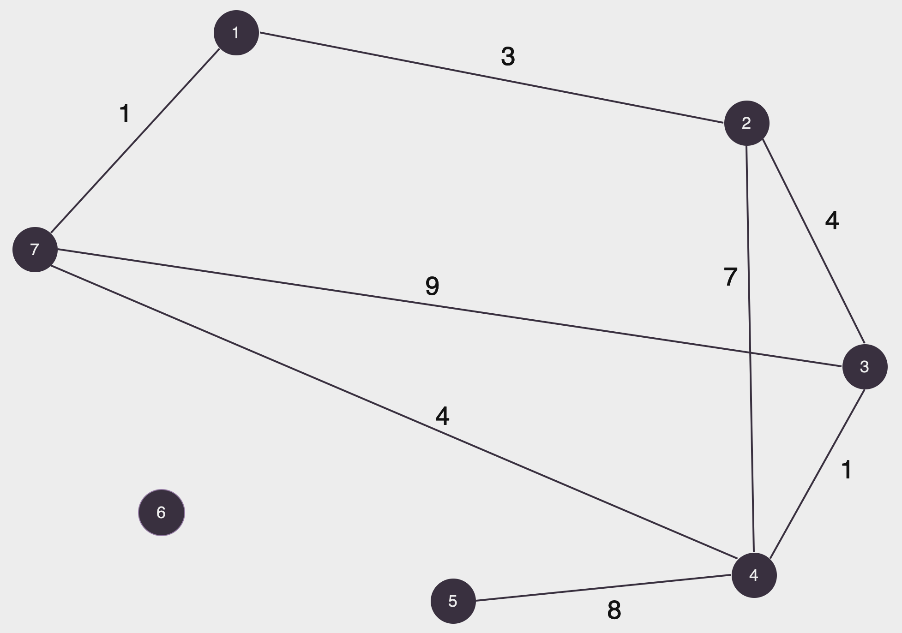
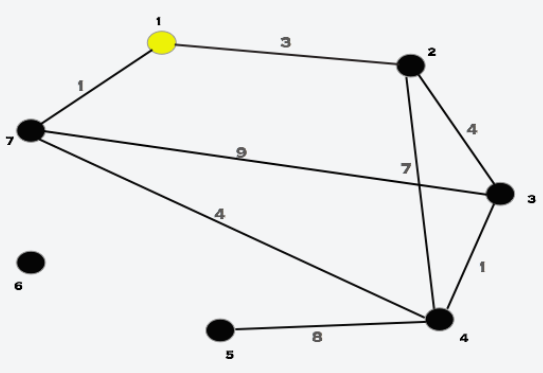
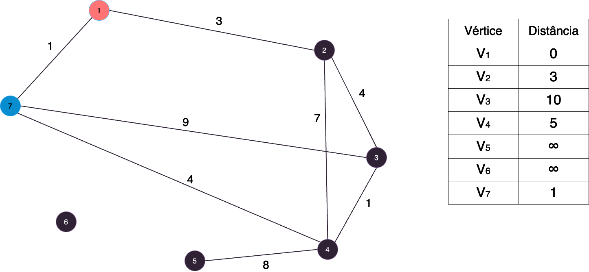
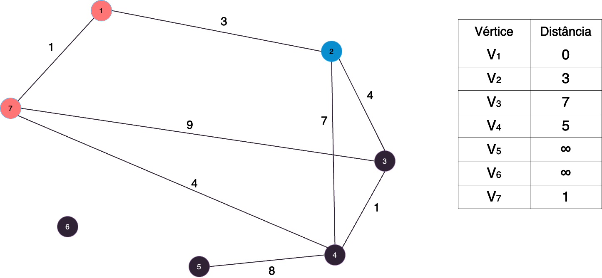
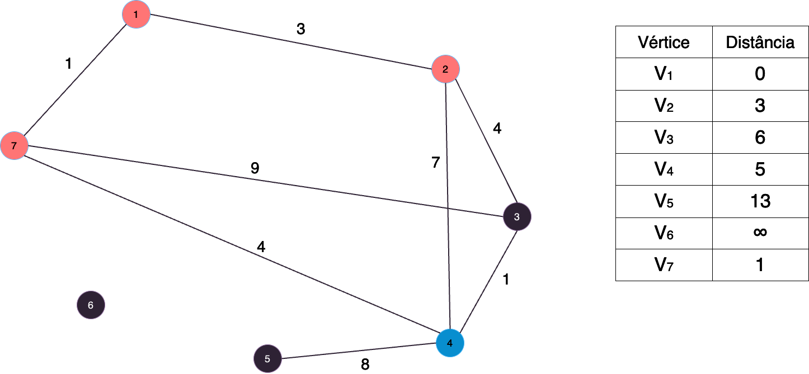
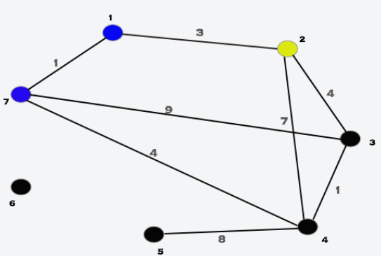
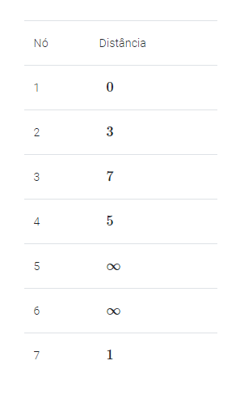
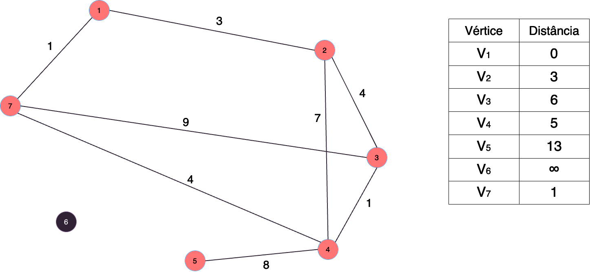

# Algoritmo de Dijkstra

## 📚 Introdução

O algoritmo de Dijkstra é um algoritmo guloso que encontra o menor caminho entre dois vértices em um grafo com arestas de peso não negativo.

Ele recebe um vértice principal S para ser a fonte do grafo e retorna o menor caminho de todos os vértices do grafo para S.

## 🤷 Como funciona?

A ideia do algoritmo consiste em:

- Definir a distância como ∞ para todos os vértices e como 0 para o vértice S.
- Em cada passo, encontrar o vértice u, que ainda não foi processado, que possua a menor das distâncias. Este vértices agora foi fixado como já tendo a menor distância de S para ele.
- Ver para cada vértice v, vizinho de u, se é melhor manter a distância atual de v ou atualizar fazendo o caminho
- S→u e depois u→v. Repare que o caminho S→u já foi fixado e possivelmente tem conexões no meio.

Vamos entender melhor com um exemplo, observe o seguinte grafo:

<figure><figcaption></figcaption></figure>

Vamos simular o Dijkstra fazendo S=1.

Primeiro, inicializamos as distâncias:

<figure><figcaption></figcaption></figure>

O vértice de menor distância é o 7. Então, selecionamos ele e atualizamos as distâncias dos vértices 3 e 4, que são
seus vizinhos.

<figure><figcaption></figcaption></figure>

O novo vértice de menor distância é o 2. Selecionamos então ele e só alteramos a distância do vértice 3 (pois não compensa
mudar o 4).

<figure><figcaption></figcaption></figure>

O novo vértice mais próximo é o vértice 4. Com ele, podemos atualizar a distância do vértice 5 e do vértice 3.

<figure><figcaption></figcaption></figure>

O novo vértice mais próximo é o 3, mas não conseguimos mudar nenhuma distância.

<figure><figcaption></figcaption></figure>

O novo vértice mais próximo é o 5, mas também não atualizamos nenhuma distância.

<figure><figcaption></figcaption></figure>

E assim concluímos o algoritmo, tendo calculado a menor distâncida do vértice 1 para qualquer outro vértice, as distâncias finais são:

<figure><figcaption></figcaption></figure>

Repare que não acessamos o 6 nenhuma vez, pois a distância dele ao 1 é infinita, o que significa que não temos como chegar nele, o que é facilmente observado como verdadeiro.

## 🧠 Exemplo de aplicação

Imagine que você está de férias na europa, mas agora está morrendo de saudades da sua casa, então você decide voltar para o Brasil o mais rápido possível, você sabe que existem voos entre algumas cidades da europa e que cada voo tem um tempo de duração, você quer saber qual o menor tempo que você pode levar para chegar no Brasil.

É possível modelar esse problema como um grafo, onde:

- Vértices: Cada uma das cidades disponíveis que possuem voos.
- Arestas: Cada um dos voos. Aqui, o peso de cada aresta é o tempo de duração de voo.

## 📝 Implementação

Vamos ver como implmentar o algoritmo de Dijkstra para resolver o problema.

É necessário pensar na lógica das duas partes principais do algoritmo: como encontrar o vértice mais próximo (vamos chamar de u) e como atualizar os valores para os vizinhos de u.

Podemos manter todas as distâncias em uma fila de prioridade (priority queue, heap), dessa maneira esse passo custa `O(log N)`.

Para o segundo passo, simplesmente percorremos por todos os vizinhos do vértice u e atualizamos as distâncias se necessário.

Vamos supor neste problema que o número de cidades é N ≤ 10.000 e que uma viagem não passa de 1000 minutos.

O código, então, fica assim:

```cpp
#include <bits/stdc++.h>

using namespace std;

const long long INF = 1e18;

// número de vértices e arestas
int n, m;

// vértice de origem e destino
int cidade_origem, cidade_destino;

// vetor de distâncias
vector<long long> distancia;

// vetor para saber quando um vértice já foi processado
vector<bool> processado;

// lista de adjacência (peso, destino)
vector<vector<pair<int, int>>> vizinhos;

void dijkstra(int S) {
    distancia[S] = 0;

    priority_queue<
        pair<long long, int>,
        vector<pair<long long, int>>,
        greater<pair<long long, int>>
    > fila;

    fila.push({0, S});

    while (!fila.empty()) {
        auto [dist, davez] = fila.top();
        fila.pop();

        // se o vértice já foi processado, ignoramos
        if (processado[davez])
            continue;

        processado[davez] = true;

        // tentamos atualizar as distâncias dos vizinhos
        for (auto [peso, atual] : vizinhos[davez]) {
            if (distancia[atual] > distancia[davez] + peso) {
                distancia[atual] = distancia[davez] + peso;
                fila.push({distancia[atual], atual});
            }
        }
    }
}

int main() {
    cin >> n >> m;
    cin >> cidade_origem >> cidade_destino;

    distancia.assign(n + 1, INF);
    processado.assign(n + 1, false);
    vizinhos.assign(n + 1, {});

    for (int i = 0; i < m; i++) {
        int x, y, tempo;
        cin >> x >> y >> tempo;

        vizinhos[x].push_back({tempo, y});
        vizinhos[y].push_back({tempo, x});
    }

    dijkstra(cidade_origem);

    cout << distancia[cidade_destino] << "\n";

    return 0;
}
```

A complexidade do algoritmo é `O(M * log N)`, onde M é o número de arestas e N é o número de vértices.

Podemos ver, então que o algoritmo de Dijkstra é uma ótima escolha para resolver problemas de menor caminho em grafos com arestas de peso não negativo.
