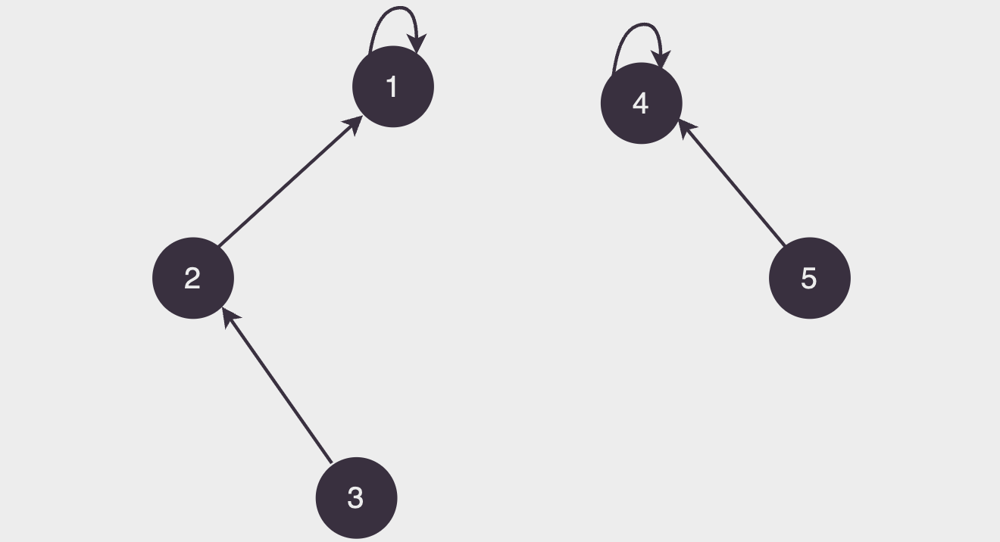
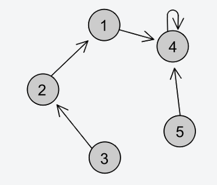

# Union-Find

## 📚 Introdução

Um jeito muito eficiente de trabalharmos com união de conjuntos disjuntos (sem elementos pertencentes aos dois ao mesmo tempo, que é o que ocorre na maioria dos casos) é o algoritmo Union-Find.

A ideia é muito simples: vamos juntar elementos como "membros de uma mesma família" e escolher um "patriarca" para cada família.

Cada elemento terá seu elemento "pai", e aquele que não tem (que é pai de si mesmo), é o patriarca da família.

Olhar se dois elementos estão na mesma família é muito simples, basta verificar se eles têm o mesmo patriarca!

Suponha que o pai de cada elemento (identificado por um número de 1 a n) está salvo no dicionário pai, onde pai[i] guarda o número do elemento que é o pai do elemento i.

Desse modo, para encontrar o patriarca de i, basta olharmos seus ancestrais um a um até encontrarmos um patriarca (alguém que é pai de si
mesmo).

<figure><figcaption></figcaption></figure>

Note que na figura acima há 5 elementos identificados por números de 1 a 5. Eles estão divididos em duas famílias, cujos patriarcas são 1 e 4.

E para unir dois elementos? Toda vez que dizemos que dois elementos quaisquer estão na mesma família, devemos fazer a união de todos os elementos das duas famílias em um conjunto só, ou seja: devemos associar o mesmo patriarca a todos eles. Para isso, basta que façamos o patriarca de uma família ser o pai do patriarca da outra, assim todos os descendentes do ex-patriarca agora serão descendentes do novo patriarca de todo o conjunto!

<figure><figcaption></figcaption></figure>

## 📝 Implementação

Em C++, podemos implementar o Union-Find da seguinte forma:

```cpp
#include <vector>

using namespace std;

int n;
vector<int> pai(n + 1);

// inicialmente, cada elemento é pai de si mesmo
for (int i = 1; i <= n; i++)
    pai[i] = i;

int find(int x) {
    // se x é pai de si mesmo, ele é o patriarca
    if (pai[x] == x)
        return x;

    // caso contrário, procuramos o patriarca do pai de x
    return find(pai[x]);
}

void join(int x, int y) {
    pai[find(x)] = find(y); // o patriarca de x passa a ser o patriarca de y
}
```

A função `find` é a responsável por encontrar o patriarca de um elemento, e a função `join` é a responsável por juntar dois elementos em uma mesma família.

Essa implementação é muito simples e eficiente, mas não é a mais eficiente possível. Para melhorar a eficiência, podemos usar uma técnica chamada compressão de caminhos.

## 📐 Otimizações

A compressão de caminhos é uma técnica que consiste em fazer com que todos os elementos de uma família apontem diretamente para o patriarca, ao invés de apontarem para o pai de seu pai, que aponta para o pai de seu pai, e assim por diante.

Assim diminuimos o tempo de execução da função `find`, pois não precisamos mais percorrer todos os ancestrais de um elemento para encontrar seu patriarca.

O código fica assim:

```cpp
#include <vector>

using namespace std;

int n;
vector<int> pai(n + 1);

// inicialmente, cada elemento é pai de si mesmo
for (int i = 1; i <= n; i++)
    pai[i] = i;

int find(int x) {
    // se x não é o patriarca
    if (x != pai[x])
        pai[x] = find(pai[x]);

    return pai[x];
}

void join(int x, int y) {
    pai[find(x)] = find(y);
}
```

Note que a função `find` agora é recursiva, e a compressão de caminhos só é feita quando o elemento não é o patriarca.

Ainda podemos fazer mais uma mudança para melhorar a eficiência: vamos fazer com que o patriarca de uma família seja aquele que tem mais elementos.

Com essas mudanças as famílias ficam mais "equilibradas", e evitamos ter famílias muito grandes e outras muito pequenas, o que poderia prejudicar a eficiência do Union-Find.

```cpp
#include <vector>

using namespace std;

int n;
vector<int> pai(n + 1), peso(n + 1, 0);

// inicialmente, cada elemento é pai de si mesmo
for (int i = 1; i <= n; i++)
    pai[i] = i;

int find(int x) {
    if (x != pai[x])
        pai[x] = find(pai[x]);

    return pai[x];
}

void join(int x, int y) {
    x = find(x);
    y = find(y);

    // se x e y já pertencem à mesma família
    if (x == y)
        return;

    // faz o patriarca da menor árvore apontar para o da maior
    if (peso[x] < peso[y]) {
        pai[x] = y;
    } else if (peso[x] > peso[y]) {
        pai[y] = x;
    } else {
        pai[x] = y;
        peso[y]++;
    }
}
```

Essa implementação do Union-Find com suas duas funções bem otimizadas é mágica! Você pode considerar que ambas têm complexidade apenas de `O(1)` e fazer tranquila e eficientemente todos os problemas que precisar.

## 🧑‍🏫 Exercícios

- Exercício [2854](https://www.beecrowd.com.br/judge/pt/problems/view/2412) do Beecrowd, que caiu no aquecimento da OBI 2018, esse exercício se trata literalmente sobre "famílias" e é um ótimo exercício para treinar o Union-Find.

- Exercício [2959](https://www.beecrowd.com.br/judge/pt/problems/view/2959) do Beecrowd, esse é bem diferente do anterior, mas também é pode ser resolvido com Union-Find.
