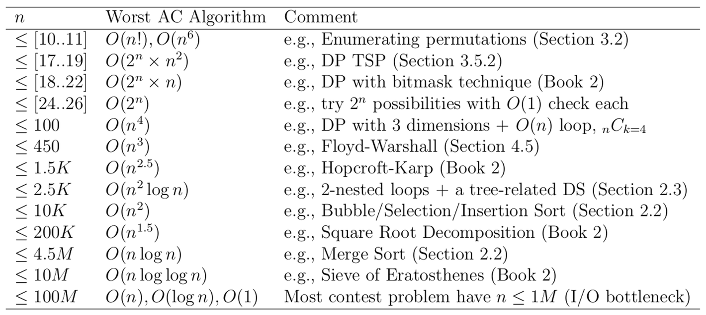

# Complexidade de Algoritmos

## 📚 Introdução

Antes de começarmos a estudar os diferentes algoritmos e estruturas de dados que usaremos no mundo da programação competitiva, primeiro precisamos entender como medir a eficiência de um programa, como sabemos que um algoritmo é melhor do que outro?

É de suma importância conseguirmos responder essa pergunta, já que temos um tempo limitado para resolver cada problema (geralmente 1 segundo), e temos que ter uma boa noção de qual algoritmo consegue rodar abaixo desse tempo em diferentes tamanhos de entrada.

Para isso, usamos a **complexidade de tempo** e complementarmente a **complexidade de espaço**.

## ⏲️ Complexidade de tempo

A complexidade de tempo de um algoritmo nos informa como o tempo de execução de um algoritmo cresce em função do tamanho da entrada, se independente da entrada o tempo é sempre o mesmo, chamamos isso de complexidade de tempo constante, e representamos usando O(1), vamos entender mais sobre isso a seguir.

Por exemplo, considere o seguinte algoritmo:

```py
def soma(n):
    soma = 0
    for i in range(n):
        soma += i
    return soma
```

Esse algoritmo recebe um número `n` e retorna a soma de todos os números de `0` até `n - 1`.

Por exemplo, se `n = 5`, o algoritmo retorna `0 + 1 + 2 + 3 + 4 = 10`.

A complexidade de tempo desse algoritmo é `O(n)`, pois ele executa `n` operações, uma para cada número de `0` até `n - 1`, isso é chamado de crescimento linear.

Chamamos essa notação de **Big O**, ela representa o pior caso de um algoritmo, ou seja, a quantidade máxima de operações que um algoritmo pode executar.

Vejamos outro exemplo:

```py
def soma(n):
    soma = 0
    for i in range(n):
        for j in range(n):
            soma += i + j
    return soma
```

Esse algoritmo também recebe um número `n` porém adicionamos um laço de repetição a mais.

Por exemplo, se `n = 3` o algoritmo retorna `(0 + 0) + (0 + 1) + (0 + 2) + (1 + 0) + (1 + 1) + (1 + 2) + (2 + 0) + (2 + 1) + (2 + 2) = 18`.

Podemos perceber então que a complexidade desse algoritmo é bem maior do que a do algoritmo anterior, isso se dá pois cada número de `0` até `n - 1` é somado com cada número de `0` até `n - 1`, isso nos dá `n * n` operações.

A complexidade de tempo desse algoritmo é `O(n^2)`, temos um crescimento quadrático.

## 📈 Complexidade de tempo de alguns algoritmos

Aqui estão alguns exemplos das complexidades de tempo mais comuns:

- **O(1)**: Constante
- **O(log n)**: Logarítmica
- **O(n)**: Linear
- **O(n log n)**: Linearítmica
- **O(n^2)**: Quadrática
- **O(n^3)**: Cúbica
- **O(2^n)**: Exponencial

É importante se atentar a complexidade de tempo de um algoritmo, pois ela pode ser a diferença entre um algoritmo que roda em 1 segundo e um que roda em 1 minuto, como podemos ver no gráfico abaixo:

<figure><figcaption></figcaption></figure>

Ao longo da nossa jornada, vamos estudar algoritmos que possuem complexidades de tempo diferentes, levando em conta os diferentes problemas que vamos enfrentar.

## 💀 Piores complexidades possíveis por tamanho de entrada

Como vimos no gráfico acima, vamos tentar evitar ao máximo algoritmos com complexidades grandes, tais como `O(n^2)`, dito isso, precisamos entender que nem sempre isso é possível, e que em alguns casos, algoritmos com complexidades maiores são necessários.

Vamos pensar em um exercício que nos peça pra achar o menor valor em um vetor, qual a menor complexidade possível para esse problema?

A menor complexidade possível é `O(n)`! pois precisamos olhar para cada elemento do vetor para saber qual é o menor valor, não tem como fazer isso sem olhar para cada elemento, veremos problemas muito mais complicados que esse mais para frente, e teremos que usar algoritmos com complexidades ainda piores, assim, é importante entender qual complexidade é aceitável levando em conta o tempo disponível e o tamanho da entrada, para isso, consulte a tabela abaixo:

<figure><figcaption></figcaption></figure>

Para cada tamanho de entrada $n$, temos as piores complexidades que são aceitáveis para passar o problema.

Geralmente, uma regra para 1s de time limit é multiplicar o tamanho máximo na complexidade. Se for menor que 10⁸ passa tranquilamente, se for na casa do 10⁸, passa apertado dependendo da sua implementação, se for maior, dificilmente passa.

Por exemplo, se o tamanho de $n$ é 400 e a complexidade for `O(n^3)`, então 400³ = 6.4 \* 10⁷, o que significa que o algoritmo deve passar o problema.

## 📈 Complexidade de espaço

Normalmente, nas competições de programação, memória não é algo que nos preocupamos muito, já que o limite geralmente é bem alto, entretanto, é importante entender também a complexidade de espaço de um algoritmo, pois ainda sim, ela pode ser um fator limitante.

Por exemplo, considere o seguinte algoritmo:

```py
def soma(n):
    numeros = [i for i in range(n)]
    soma = 0
    for i in numeros:
        soma += i
    return soma
```

Esse algoritmo recebe um número `n` e retorna a soma de todos os números de `0` até `n - 1`, usando uma lista para armazenar os números.

A complexidade de espaço desse algoritmo é `O(n)`, pois ele ocupa `n` posições na memória, uma para cada número de `0` até `n - 1`.

Vejamos outro exemplo:

```py
def soma(n):
    numeros = [[i for i in range(n)] for j in range(n)]
    soma = 0
    for i in numeros[0]:
        soma += i
    return soma
```

Note que esse algoritmo também recebe um número `n` e também retorna a soma de todos os números de `0` até `n - 1`, porém usamos uma matriz para armazenar os números, cada linha da matriz é um vetor de `0` até `n - 1`, estamos consumindo mais memória e tendo o mesmo resultado.

Isso nos dá uma complexidade de espaço de `O(n^2)`, pois ele ocupa `n * n` posições na memória, cada número de `0` até `n - 1` é armazenado `n - 1` vezes, podemos visualizar isso rodando os dois exemplos acima e printando a variável `numeros`, assim como o resultado da soma.

**Exemplo 1**

```bash
soma(10)
[0, 1, 2, 3, 4, 5, 6, 7, 8, 9]
45
```

**Exemplo 2**

```bash
soma(10)
[[0, 1, 2, 3, 4, 5, 6, 7, 8, 9], [0, 1, 2, 3, 4, 5, 6, 7, 8, 9], [0, 1, 2, 3, 4, 5, 6, 7, 8, 9], [0, 1, 2, 3, 4, 5, 6, 7, 8, 9], [0, 1, 2, 3, 4, 5, 6, 7, 8, 9], [0, 1, 2, 3, 4, 5, 6, 7, 8, 9], [0, 1, 2, 3, 4, 5, 6, 7, 8, 9], [0, 1, 2, 3, 4, 5, 6, 7, 8, 9], [0, 1, 2, 3, 4, 5, 6, 7, 8, 9], [0, 1, 2, 3, 4, 5, 6, 7, 8, 9]]
45
```

Perceba que nesse exemplo simples, estamos gastando mais memória sem necessidade, geralmente isso não é um problema, e as vezes até usamos mais memória para alcançar um desempenho melhor, mas é importante entender que isso também é um fator a ser considerado, e que pode nos afetar negativamente caso sejamos descuidados.
