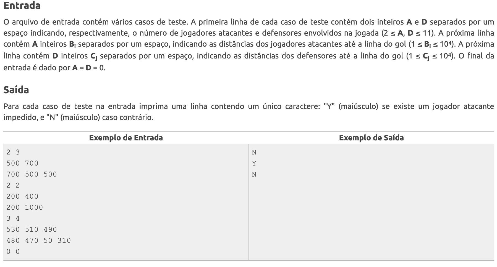
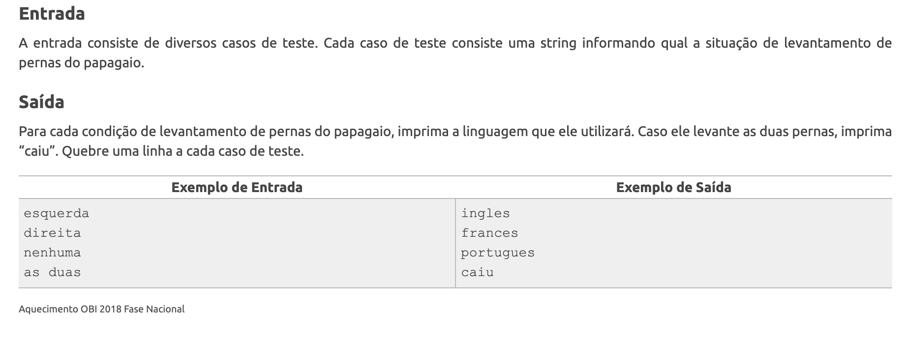

# Entradas e saídas

## 📚 Introdução

Nesse artigo, vamos aprender como fazer as entradas e saídas nos exercícios de programação competitiva, no geral usaremos os comandos padrões `input()` e `print()`, porém existem alguns casos que valem a pena serem explicados com mais detalhes, como os exercícios que utilizam EOF (End of File) e os que precisam de fast io.

## 📥 Entradas

Como mencionado, normalmente usaremos o método padrão de input do Python, com a função `input()`.

Quando queremos ler mais de uma string na mesma linha, como por exemplo:

```
ufms feijoada
```

podemos usar o `split()`:

```py
a, b = input().split()
```

Agora se quisermos ler mais de um valor numérico, é melhor usar a função `map()`, que já converte os valores para o tipo desejado:

```py
a, b = map(int, input().split())
```

Se precisarmos que os valores sejam armazenados em uma lista, podemos usar a coompreensão de listas.

```py
a = [int(x) for x in input().split()]
```

Esse métodos é mais lento que o `map()`, então só o use quando você realmente precisa de uma lista, ou quando não se sabe o número de valores que serão lidos.

Antes de continuar, é importante conversar um pouco sobre os diferentes tipos de entradas que podemos encontrar, geralmente sabemos exatamente o número de linhas que serão lidas, por alguma estipulação do enunciado ou um valor do próprio input nos indica, como no exercício 1410 do Beecrowd:

<figure><figcaption></figcaption></figure>

A entrada pode parecer complicada, mas note que a primeira linha lida nos indica exatamente quantos valores vem a seguir, e o fim é indicado por dois valores 0 seguidos, ent˜ao podemos ler a entrada da seguinte forma:

```py
while True:
    atacantes, defensores = map(int, input().split())

    if atacantes == 0 or defensores == 0:
        break
```

Porém, existem casos onde não sabemos o número de linhas que serão lidas, como no exercício 2850 do Beecrowd:

<figure><figcaption></figcaption></figure>

O exercício nem nos disse isso, mas o final de um arquivo de entrada é sempre indicado por EOF (End of File), como não sabemos o número de linhas que serão lidas, nossa única opção é usar um loop infinito e tentar ler a entrada, e quando o EOF for encontrado, o Python lançará uma exceção `EOFError`, que podemos usar para sair do loop:

```py
while True:
    try:
        lado = input()
        # restante do código
    except EOFError:
        break # entrada acabou, podemos sair do loop

```

Em alguns problemas, precisaremos ler centenas de linhas com centenas de valores, nesses casos, é recomendável usar fast io, ou métodos rápidos de entrada e saída, o jeito mais rápido de ler valores em Python é usando o `sys.stdin.readline()`:

```py
import sys

a, b = map(int, sys.stdin.readline().split())
vet = [int(x) for x in sys.stdin.readline().split()]
```

Como pode ver, na maior parte dos casos só trocar o `input()` por `sys.stdin.readline()` é suficiente, porém temos que manter algo em mente ao usar o `sys.stdin.readline()`:

- Ele lê o `\n` no final da linha, isso normalmente não afeta em nada, pois o `split()` e `int()` já o removem, porém se quisermos ler uma única string a cada linha, temos que usar o `.rstrip()`.

## 📤 Saídas

O método padrão de output do Python é o `print()`, e é ele que usaremo na maior parte dos casos, porém, se precisarmos de fast io, temos que usar o `sys.stdout.write()`:

```py
import sys

sys.stdout.write(str(a) + '\n')
```

Note que usei ambas `str()` e `+ '\n'`, isso porque, assim como anteriormente, temos que manter algumas coisas em mente ao usar o `sys.stdout.write()`:

- Ele só aceita strings, então se quisermos escrever um inteiro, temos que usar o `str()` ou f-strings:

```py
import sys

a = 42
sys.stdout.write(str(a) + '\n')
sys.stdout.write(f'{a}\n')
```

- Ele não coloca o `\n` automaticamente no final da linha, isso é importante pois os juízes de código não aceitam a resposta se não tiver o `\n` no final da linha.

## 🧑‍🏫 Exercícios

Nenhum exercício listado aqui precisam de fast io, porém, eles são bons para treinar o uso do `sys.stdin.readline()` e do `sys.stdout.write()`, assim quando você encontrar um onde o tempo é um problema, usar esses métodos é um bom truque a se aplicar.

- Exercício [2850](https://judge.beecrowd.com/pt/problems/view/2850) do Beeecrowd, que estava no aquecimento da OBI 2018, na fase nacional.

- Exercício [1248](https://www.beecrowd.com.br/judge/pt/problems/view/1248) do Beecrowd, que caiu na OBI 2012.

- Exercício [2408](https://www.beecrowd.com.br/judge/pt/problems/view/2408) do Beecrowd, que caiu na OBI 2012.

- Exercício [2420](https://www.beecrowd.com.br/judge/pt/problems/view/2420) do Beecrowd, que caiu na OBI 2012.

- Exercício [1410](https://www.beecrowd.com.br/judge/pt/problems/view/1410) do Beecrowd, que caiu na ACM/ICPC South America Contest 2007.

- Exercício [2770](https://www.beecrowd.com.br/judge/pt/problems/view/2770) do Beecrowd, que caiu na V Maratona Norte Mineira de Programação, não se assuste com o nível 7 desse exercício, mantenha a calma e leia o que se pede.
