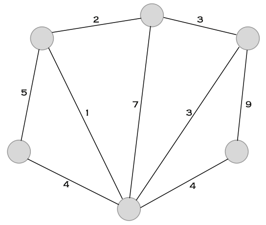
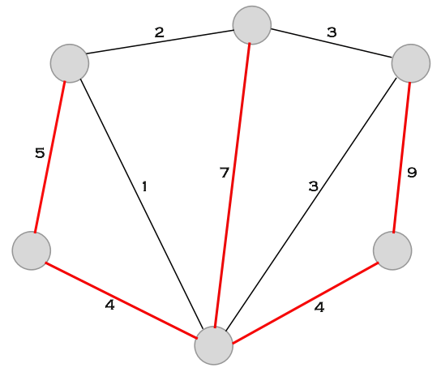
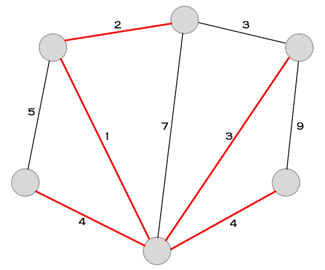
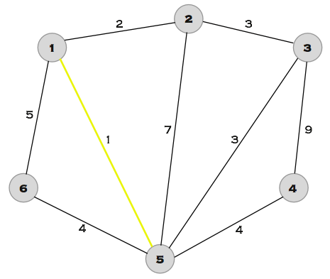
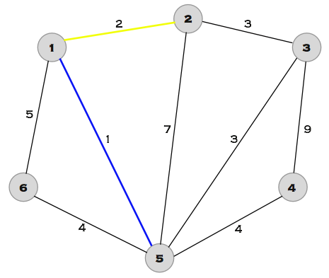
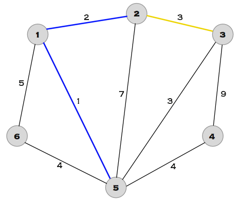
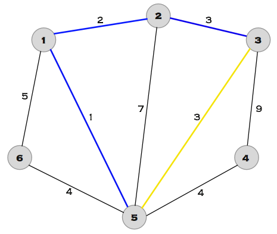
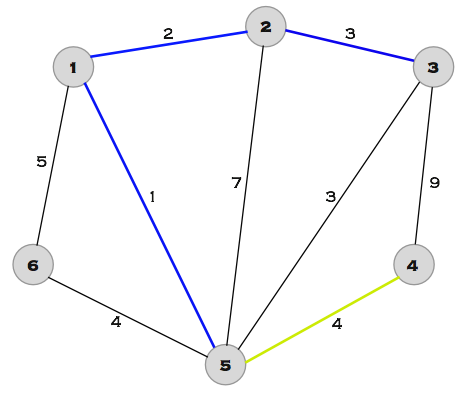
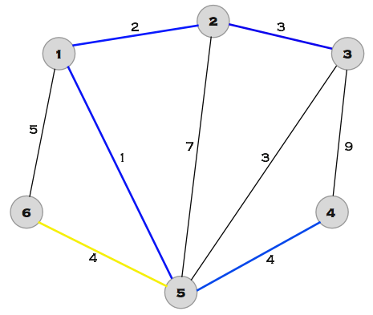

# Algoritmo de Kruskal

## 📚 Introdução

O estimado Dr. Kapi Vara da UFMS foi contratado para pavimentar as estradas do Mato Grosso do Sul, de forma que todas as cidades do estado sejam acessíveis por estradas pavimentadas. O Dr. Vara sabe que o custo de pavimentação de uma estrada entre duas cidades é proporcional à distância entre elas. Ele quer escolher as estradas de forma a ter o menor custo possível, mas ele não sabe por onde começar. Sabendo das suas habilidades em programação, ele pediu sua ajuda para resolver esse problema.

<!-- Adicione mais explicações sobre o conceito de árvore -->

Para resolver esse problema, podemos modelar as cidades como vértices e as estradas existentes como arestas de um grafo, o custo da pavimentação, seria o peso das nossas arestas. O problema, então, se torna encontrar a árvore geradora mínima desse grafo, ou seja, a árvore que conecta todos os vértices com o menor custo (soma dos pesos) possível.

Vejamos o seguinte grafo:

<figure><figcaption></figcaption></figure>

Sabemos que, o menor número de arestas que precisamos ter para conectar todos os vértices de um grafo é o número de vértices - 1. No caso do grafo acima, precisamos de 5 arestas para conectar todos os vértices, existem várias formas de escolher essas arestas, vejamos duas delas:

<figure><figcaption></figcaption></figure>
<figure><figcaption></figcaption></figure>

Note que ambos exemplos são árvores geradoras do grafo, entretanto, a soma dos pesos das arestas da segunda árvore é consideravelmente menor, ela é um exemplo de árvore geradora mínima. Podem existir várias árvores geradoras mínimas para um grafo, mas todas elas terão o mesmo peso.

Existem dois algoritmos muito eficientes e conhecidos para resolver esse problema, o algoritmo de Kruskal e o algoritmo de Prim. Neste artigo, vamos focar no algoritmo de Kruskal.

## 🤷 Como funciona?

A ideia do algoritmo consiste em:

- Ordenar as arestas do grafo em ordem crescente de peso.
- Para cada aresta, se ela não forma um ciclo com as arestas já escolhidas, adicionamos ela à árvore geradora mínima.

Mas como verificar se uma aresta forma um ciclo com as arestas já escolhidas?

Para isso podemos utilizar a teoria dos conjuntos! Podemos representar cada vértice como um conjunto, e a cada aresta adicionada, unimos os conjuntos dos vértices que ela conecta. Se, ao tentar adicionar uma aresta, os vértices que ela conecta já estão no mesmo conjunto, então ela forma um ciclo.

Sendo assim, podemos utilizar um algoritmo que já vimos anteriormente, o algoritmo de [Union-Find](union_find.md), vamos lembrar também que esse algoritmo é muito eficiente (`O(log n)`!), para verificar se uma aresta forma um ciclo.

Vamos entender melhor simulando o algoritmo de Kruskal no grafo acima (agora com os vértices enumerados):

<figure><figcaption></figcaption></figure>

As arestas listadas em ordem crescente de peso são: (1, 5), (1, 2), (2, 3), (3, 5), (4, 5), (5, 6), (1, 6), (2, 5), (3, 4)

Começamos pela menor aresta, como os vértices 1 e 5 não estão no mesmo conjunto, adicionamos a aresta (1, 5) à árvore geradora mínima:

<figure><figcaption></figcaption></figure>

A próxima aresta é (1, 2), como os vértices 1 e 2 não estão no mesmo conjunto, adicionamos a aresta (1, 2) à árvore geradora mínima:

<figure><figcaption></figcaption></figure>

A próxima aresta é (2, 3), como os vértices 2 e 3 não estão no mesmo conjunto, adicionamos a aresta (2, 3) à árvore geradora mínima:

<figure><figcaption></figcaption></figure>

A próxima aresta é (3, 5), porém perceba que os vértices 3 e 5 estão no mesmo conjunto, então não podemos adicionar essa aresta, pois ela formaria um ciclo:

<figure><figcaption></figcaption></figure>

A próxima aresta é (4, 5), como os vértices 4 e 5 não estão no mesmo conjunto, adicionamos a aresta (4, 5) à árvore geradora mínima:

<figure><figcaption></figcaption></figure>

A próxima aresta é (5, 6), como os vértices 5 e 6 não estão no mesmo conjunto, adicionamos a aresta (5, 6) à árvore geradora mínima:

<figure><figcaption></figcaption></figure>

E assim montamos nossa árvore geradora mínima!

Note que ela é diferente da árvore geradora mínima que mostramos anteriormente, mas ambas têm o mesmo peso.

Perceba também que esse algoritmo é eficiente, a complexidade dele é `O(M * log N)`, onde M é o número de arestas e N é o número de vértices e que ele implementa a ideia de um algoritmo guloso, já que ordenamos as arestas e só verificamos se podemos adicioná-las à árvore geradora mínima se elas não formarem um ciclo, mas como sempre começamos pelas menores arestas, garantimos que a árvore geradora mínima terá o menor peso possível.

## 📝 Implementação

Para implementar o algoritmo de Kruskal, vamos usar as ideias que discutimos anteriormente, implementamos o algoritmo do Union-Find, e ordenamos as arestas em ordem crescente de peso, feito isso, basta iterar sobre as arestas e verificar se elas fazem parte do mesmo conjunto. Vamos ver como fica a implementação em Python:

```py
def find(x):
    # se x é pai de si mesmo, ele é o patriarca
    if x != pai[x]:
        pai[x] = find(pai[x])
    return pai[x]


def join(x, y):
    x = find(x)
    y = find(y)

    # se x e y já estão na mesma família, não precisamos fazer nada
    if x == y:
        return

    # se x e y não estão na mesma família, vamos juntar as duas
    # fazendo com que o patriarca da maior família seja o pai do patriarca da menor família
    if peso[x] < peso[y]:
        pai[x] = y

    if peso[x] > peso[y]:
        pai[y] = x

    if peso[x] == peso[y]:
        pai[x] = y
        peso[y] += 1


def kruskal(arestas):
    arestas.sort(key=lambda a: a['dist'])

    # essa parte pode ser otimizada, sabendo o número de vértices, você sabe quantas arestas sua mst
    # terá no máximo, então você pode inicializar uma lista com esse tamanho e usar uma variável auxiliar
    # para adicionar diretamente na posição correta, sem precisar usar o append
    mst = []
    for aresta in arestas:
        u = aresta['x']
        v = aresta['y']
        if find(u) != find(v):
            mst.append(aresta)
            join(u, v)

    return mst


n, m = map(int, input().split()) # número de vértices e arestas do grafo

# inicialmente, cada vertice é pai de si mesmo
pai = {i: i for i in range(1, n + 1)}
peso = {i: 0 for i in range(1, n + 1)}  # usamos os pesos para otimizar o find

arestas = [{"x": 0, "y": 0, "dist": 0} for _ in range(m)]

for i in range(m):
    x, y, dist = map(int, input().split())
    arestas[i] = {"x": x, "y": y, "dist": dist}

mst = kruskal(arestas)
print(mst)
```

Como dito anteriormente, a complexidade do algoritmo é `O(M * log N)`, onde M é o número de arestas e N é o número de vértices.

Podemos ver então, que o algoritmo de Kruskal é uma ótima opção para encontrar a árvore geradora mínima de um grafo, devido a sua eficiência e relativa simplicidade de implementação.

## 🧑‍🏫 Exercícios
