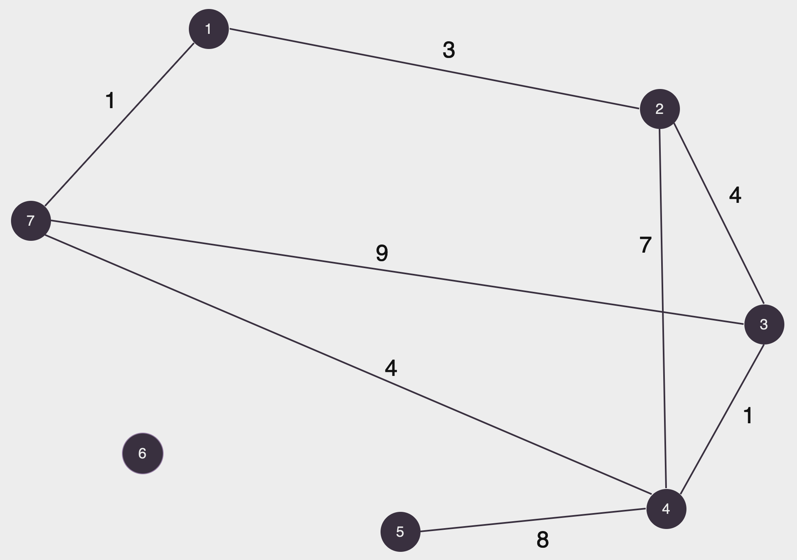
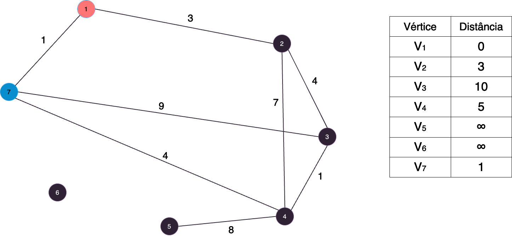
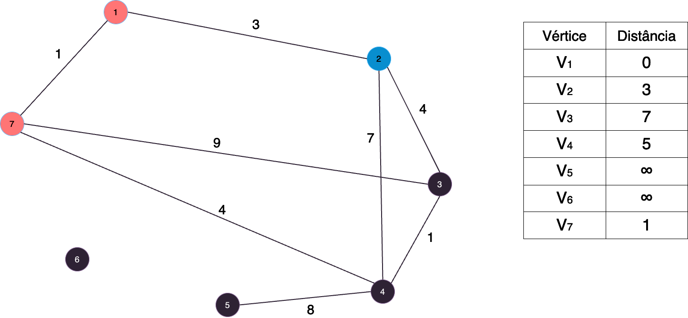
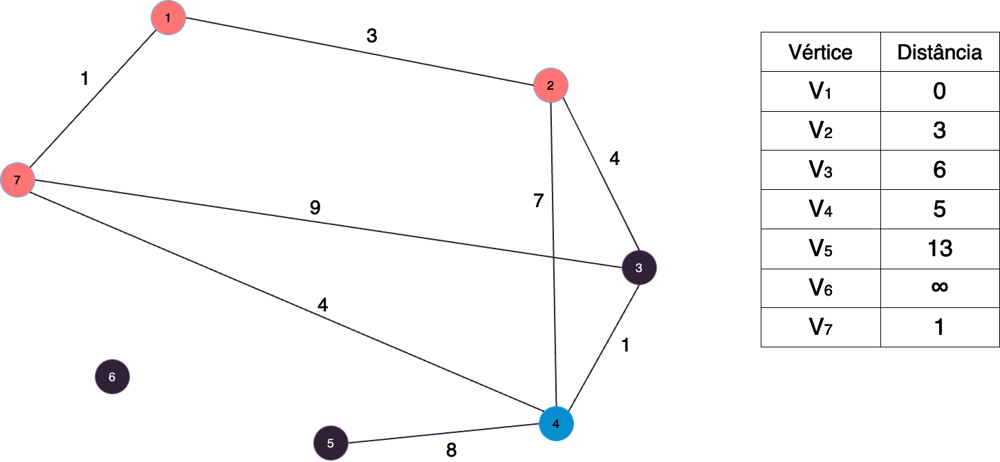
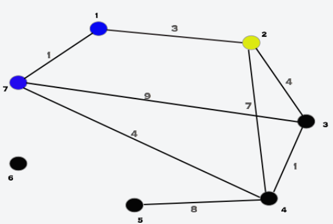
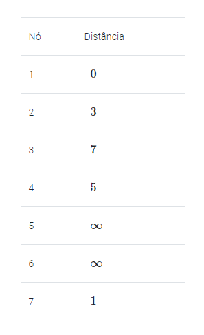
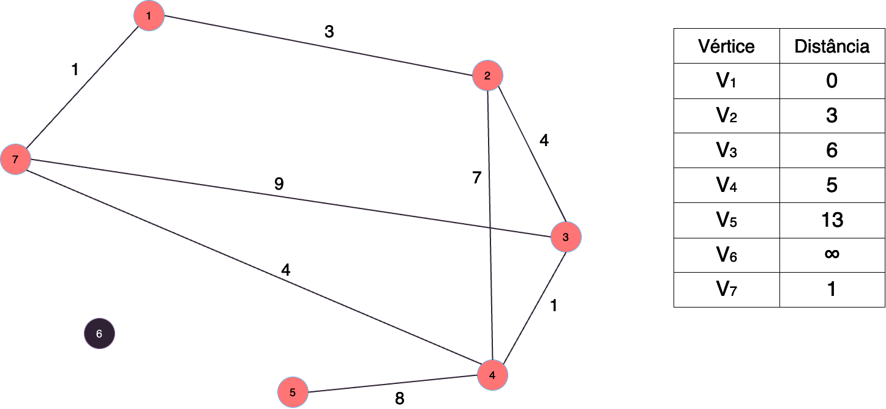
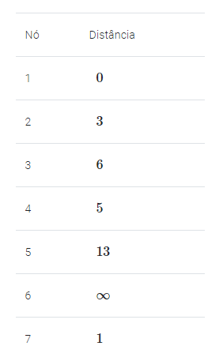

# Algoritmo de Dijkstra

## 📚 Introdução

O algoritmo de Dijkstra é um algoritmo guloso que encontra o menor caminho entre dois vértices em um grafo com arestas de peso não negativo.

Ele recebe um vértice principal S para ser a fonte do grafo e retorna o menor caminho de todos os vértices do grafo para S.

## 🤷 Como funciona?

A ideia do algoritmo consiste em:

- Definir a distância como ∞ para todos os vértices e como 0 para o vértice S.
- Em cada passo, encontrar o vértice u, que ainda não foi processado, que possua a menor das distâncias. Este vértices agora foi fixado como já tendo a menor distância de S para ele.
- Ver para cada vértice v, vizinho de u, se é melhor manter a distância atual de v ou atualizar fazendo o caminho
- S→u e depois u→v. Repare que o caminho S→u já foi fixado e possivelmente tem conexões no meio.

Vamos entender melhor com um exemplo, observe o seguinte grafo:

<figure><figcaption></figcaption></figure>

Vamos simular o Dijkstra fazendo S=1.

Primeiro, inicializamos as distâncias:

<figure><figcaption></figcaption></figure>

<figure><figcaption></figcaption></figure>

O vértice de menor distância é o 7. Então, selecionamos ele e atualizamos as distâncias dos vértices 3 e 4, que são
seus vizinhos.

<figure><figcaption></figcaption></figure>

<figure><figcaption></figcaption></figure>

O novo vértice de menor distância é o 2. Selecionamos então ele e só alteramos a distância do vértice 3 (pois não compensa
mudar o 4).

<figure><figcaption></figcaption></figure>

<figure><figcaption></figcaption></figure>

O novo vértice mais próximo é o vértice 4. Com ele, podemos atualizar a distância do vértice 5 e do vértice 3.

<figure><figcaption></figcaption></figure>

<figure><figcaption></figcaption></figure>

O novo vértice mais próximo é o 3, mas não conseguimos mudar nenhuma distância.

<figure><figcaption></figcaption></figure>

<figure><figcaption></figcaption></figure>

O novo vértice mais próximo é o 5, mas também não atualizamos nenhuma distância.

<figure><figcaption></figcaption></figure>

<figure><figcaption></figcaption></figure>

Repare que não acessamos o 6 nenhuma vez, pois a distância dele ao 1 é infinita, o que significa que não temos como chegar nele, o que é facilmente observado como verdadeiro.

## 🧠 Exemplo de aplicação

Imagine que você está de férias na europa, mas agora está morrendo de saudades da sua casa, então você decide voltar para o Brasil o mais rápido possível, você sabe que existem voos entre algumas cidades da europa e que cada voo tem um tempo de duração, você quer saber qual o menor tempo que você pode levar para chegar no Brasil.

É possível modelar esse problema como um grafo, onde:

- Vértices: Cada uma das cidades disponíveis que possuem voos.
- Arestas: Cada um dos voos. Aqui, o peso de cada aresta é o tempo de duração de voo.

## 📝 Implementação

Vamos ver como implmentar o algoritmo de Dijkstra para resolver o problema.

É necessário pensar na lógica das duas partes principais do algoritmo: como encontrar o vértice mais próximo (vamos chamar de u) e como atualizar os valores para os vizinhos de u.

Podemos manter todas as distâncias em uma fila de prioridade (priority queue, heap), dessa maneira esse passo custa `O(log N)`.

Para o segundo passo, simplesmente percorremos por todos os vizinhos do vértice u e atualizamos as distâncias se necessário.

Vamos supor neste problema que o número de cidades é N ≤ 10.000 e que uma viagem não passa de 1000 minutos.

O código, então, fica assim:

```py
import heapq

# número de vértices e arestas
n, m = map(int, input().split())

# vértice de origem
cidade_origem, cidade_destino = map(int, input().split())

# vetor de distâncias
distancia = [float('inf')] * (n + 1)
# vetor para saber quando um vértice já foi processado
processado = [False] * (n + 1)
# lista de adjacência, com o peso
vizinhos = [[] for _ in range(n + 1)]


def Dijkstra(S):
    # iniciamos a distância do vértice origem como 0 e começaamos por ele
    distancia[S] = 0
    fila = [(0, S)]

    while fila:
        davez = -1

        while fila:
            # pegamos a aresta com menor peso
            dist, atual = heapq.heappop(fila)

            # verificamos se ela já foi processada
            if not processado[atual]:
                davez = atual
                break

        # se todas as arestas já foram processadas, então terminamos
        if davez == -1:
            break

        # marcamos que o vértice davez foi processado
        processado[davez] = True

        # agora, tentamos atualizar a distância dos vizinhos de davez
        for dist, atual in vizinhos[davez]:
            # a nova possível distância é distancia[davez] + dist
            if distancia[atual] > distancia[davez] + dist:
                # atualizamos a distância se ela ficou menor
                distancia[atual] = distancia[davez] + dist
                heapq.heappush(fila, (distancia[atual], atual))


for _ in range(m):
    x, y, tempo = map(int, input().split())
    vizinhos[x].append((tempo, y))
    vizinhos[y].append((tempo, x))

Dijkstra(cidade_origem)
print(distancia[cidade_destino])
```

A complexidade do algoritmo é `O(M * log N)`, onde M é o número de arestas e N é o número de vértices.

Podemos ver, então que o algoritmo de Dijkstra é uma ótima escolha para resolver problemas de menor caminho em grafos com arestas de peso não negativo.
