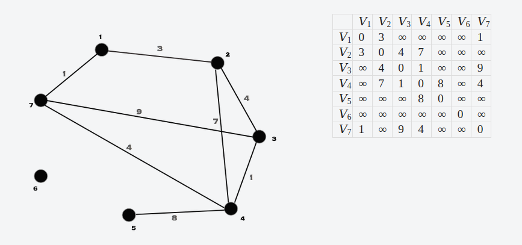
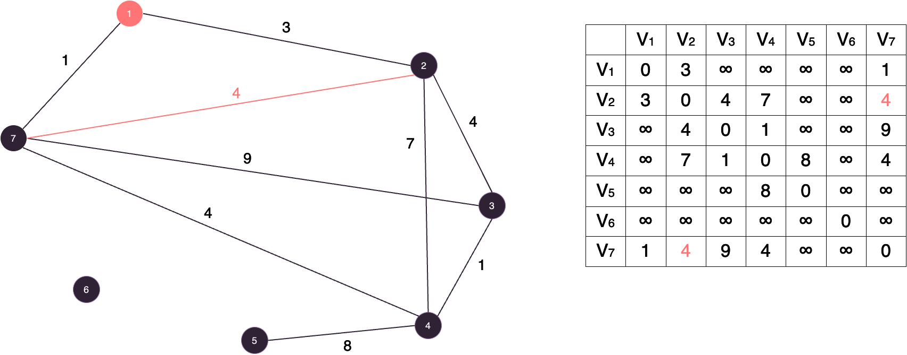
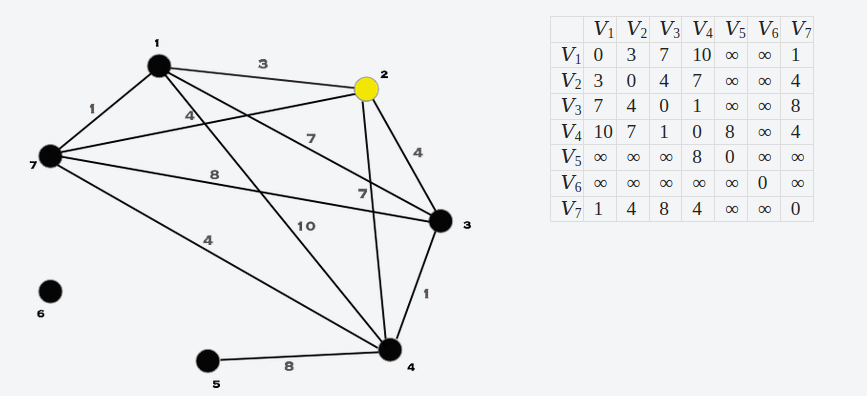
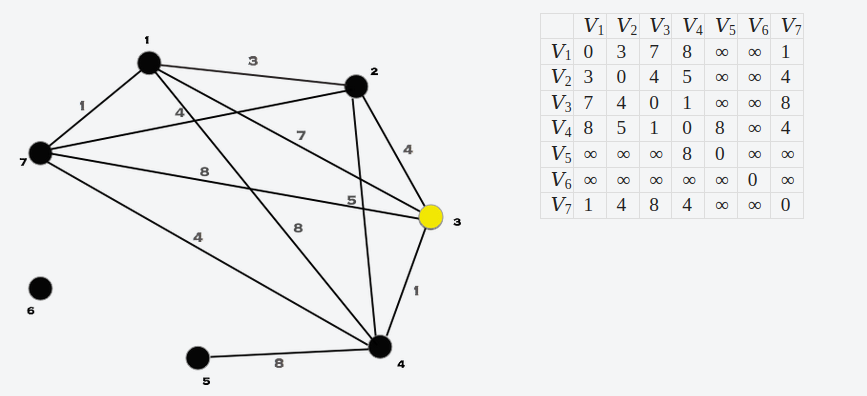
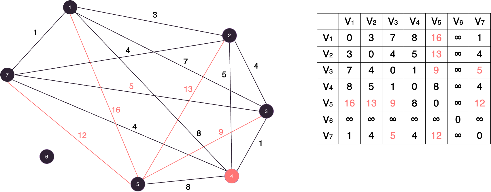
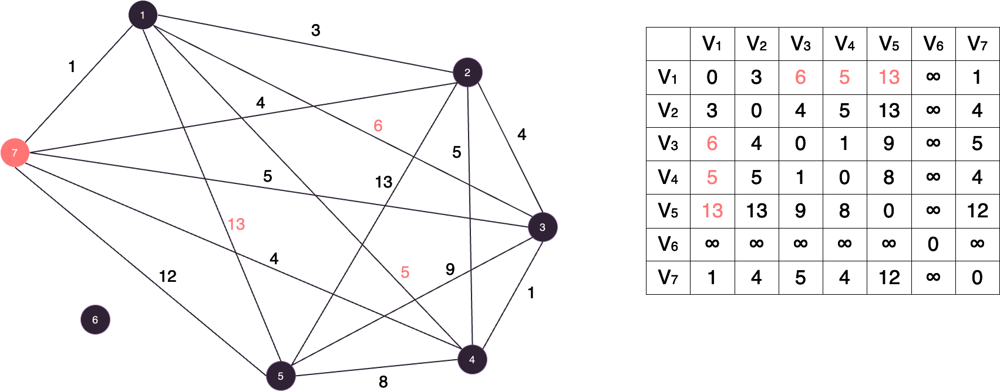

# Algoritmo de Floyd-Warshall

## 📚 Introdução

Na aula anterior, vimos o funcionamento do algoritmo de Dijkstra, que encontra o menor caminho entre dois vértices em um grafo.

Porém, vamos imaginar agora, que queremos saber a distância de qualquer vértice para qualquer outro vértice.

Podemos fazer isso com o Djikstra, porém teriamos que rodar o algoritmo para cada vértice, o que seria muito ineficiente.

Vamos apresentar um outro algoritmo agora, o Algoritmo de Floyd-Warshall, que possui um código extremamente simples que resolve esse problema para nós em `O(N³)`.

## 🤷 Como funciona?

A ideia do Algoritmo de Floyd-Warshall é bem simples e consiste basicamente de:

- Selecionar um vértice k diferente por vez. Por simplicidade, percorreremos os vértices em ordem crescente.
- Ver, para par de vértices i e j, se é melhor manter a distância atual de i a j ou atualizar fazendo o caminho i→k e depois k→j.

Aplicando no exemplo anterior, vamos escolher uma cidade por vez e recalcular as distâncias entre as outras cidades, vendo se é melhor passar pela cidade escolhida ou não.

Vamos simular o algoritmo usando o mesmo grafo da aula anterior para exemplificar. Com uma pequena mudança que dessa vez usaremos uma matriz de adjacência, e definiremos a distância de um vértice para ele mesmo como 0.

<figure><figcaption></figcaption></figure>

Começamos executando no vértice 1 e a única distância que alteramos é entre os vértices 2 e 7.

<figure><figcaption></figcaption></figure>

Agora vamos para o vértice 2 e alteramos as distâncias entre os pares (1,3), (1,4) e (3,7).

<figure><figcaption></figcaption></figure>

Note que a partir daqui o grafo começa a ficar com muitas arestas, então talvez seja melhor dar mais atenção a matriz de distâncias.

De todas formas, vamos para o vértice 3, onde atualizamos as distâncias entre os pares (1,4) e (2,4).

<figure><figcaption></figcaption></figure>

Agora vamos para o vértice 44, onde atualizamos as distâncias dos pares (1,5), (2,5), (3,5), (3,7) e (5,7).

<figure><figcaption></figcaption></figure>

Quando executamos o processo nos vértices 5 e 6, nada é alterado. Quando executamos no vértice 7, alteramos as distâncias dos pares (1,3), (1,4), (1,5).

<figure><figcaption></figcaption></figure>

Com isso finalizamos o algoritmo e agora temos o menor caminho de qualquer vértice para qualquer outro vértice.

## 📝 Implementação

A implementação do código é bem simples, simplesmente usamos um `for` para iterar por todos os vértices que usaremos como pivô e mais dois loops para percorrer todos os pares de vértices.

O código em python fica:

```python
dist = [[0 if i == j else float('inf') for i in range(n)] for j in range(n)]

for k in range(n):
    for i in range(n):
        for j in range(n):
            dist[i][j] = min(dist[i][j], dist[i][k] + dist[k][j])
```

Nesse caso, tomamos vantagem da compressão de listas do python para criar a matriz de adjacência do jeito que queremos.

Como vimos, esse algoritmo possui uma complexidade de `O(N³)`, que aparenta ser um absurdo para resolver um problema de menor caminho, mas é a melhor solução para esse tipo de exercício, e pela complexidade os valores de `N` serão pequenos.
