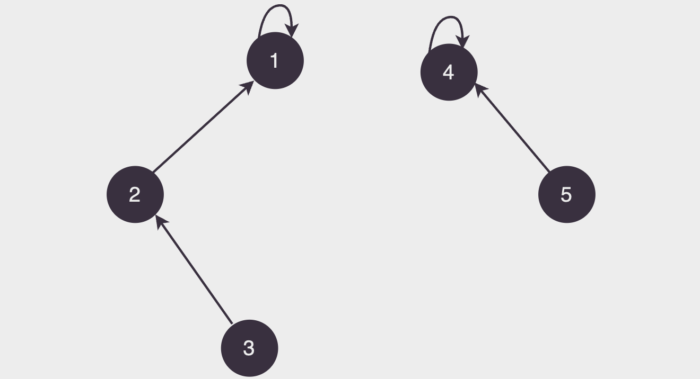
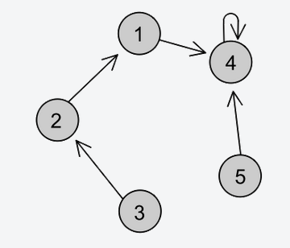

# Union-Find

## 📚 Introdução

Um jeito muito eficiente de trabalharmos com união de conjuntos disjuntos (sem elementos pertencentes aos dois ao mesmo tempo, que é o que ocorre na maioria dos casos) é o algoritmo Union-Find.

A ideia é muito simples: vamos juntar elementos como "membros de uma mesma família" e escolher um "patriarca" para cada família.

Cada elemento terá seu elemento "pai", e aquele que não tem (que é pai de si mesmo), é o patriarca da família.

Olhar se dois elementos estão na mesma família é muito simples, basta verificar se eles têm o mesmo patriarca!

Suponha que o pai de cada elemento (identificado por um número de 1 a n) está salvo no vetor dicionário pai, onde pai[i] guarda o número do elemento que é o pai do elemento i.

Desse modo, para encontrar o patriarca de i, basta olharmos seus ancestrais um a um até encontrarmos um patriarca (alguém que é pai de si 
mesmo).

<p align='center'>

</p>

Note que na figura acima há 5 elementos identificados por números de 1 a 5. Eles estão divididos em duas famílias, cujos patriarcas são 1 e 4.

E para juntar dois elementos? Toda vez que dizemos que dois elementos quaisquer estão na mesma família, devemos fazer a união de todos os elementos das duas famílias em um conjunto só, ou seja: devemos associar o mesmo patriarca a todos eles. Para isso, basta que façamos o patriarca de uma família ser o pai do patriarca da outra, assim todos os descendentes do ex-patriarca agora serão descendentes do novo patriarca de todo o conjunto!

<p align='center'>

</p>

## 🔗 Implementação

Em python, podemos implementar o Union-Find da seguinte forma:

```py
pai = {i: i for i in range(1, n + 1)} # inicialmente, cada elemento é pai de si mesmo

def find(x):
    # se x é pai de si mesmo, ele é o patriarca
    if pai[x] == x:
        return x

    # caso contrário, x não é o patriarca, então vamos procurar o patriarca de seu pai
    return find(pai[x])


def join(x, y):
    pai[find(x)] = find(y) # o patriarca de x passa a ser o patriarca de y
```

A função `find` é a responsável por encontrar o patriarca de um elemento, e a função `join` é a responsável por juntar dois elementos em uma mesma família.

Essa implementação é muito simples e eficiente, mas não é a mais eficiente possível. Para melhorar a eficiência, podemos usar uma técnica chamada compressão de caminhos.

## 📐 Otimizações

A compressão de caminhos é uma técnica que consiste em fazer com que todos os elementos de uma família apontem diretamente para o patriarca, ao invés de apontarem para o pai de seu pai, que aponta para o pai de seu pai, e assim por diante.

Assim diminuimos o tempo de execução da função `find`, pois não precisamos mais percorrer todos os ancestrais de um elemento para encontrar seu patriarca.

O código fica assim:

```py
pai = {i: i for i in range(1, n + 1)} # inicialmente, cada elemento é pai de si mesmo

def find(x):
    # se x é pai de si mesmo, ele é o patriarca
    if x != pai[x]:
        pai[x] = find(pai[x])
    return pai[x]


def join(x, y):
    pai[find(x)] = find(y) # o patriarca de x passa a ser o patriarca de y
```

Note que a função `find` agora é recursiva, e a compressão de caminhos só é feita quando o elemento não é o patriarca.

Ainda podemos fazer mais uma mudança para melhorar a eficiência: vamos fazer com que o patriarca de uma família seja aquele que tem mais elementos.

Com essas mudanças as famílias ficam mais "equilibradas"

```py
pai = {i: i for i in range(1, n + 1)} # inicialmente, cada elemento é pai de si mesmo
peso = {i: 0 for i in range(1, n + 1)} # inicialmente, cada família tem peso 0

def find(x):
    # se x é pai de si mesmo, ele é o patriarca
    if x != pai[x]:
        pai[x] = find(pai[x])
    return pai[x]


def join(x, y):
    x = find(x)
    y = find(y)

    # se x e y já estão na mesma família, não precisamos fazer nada
    if x == y:
        return

    # se x e y não estão na mesma família, vamos juntar as duas
    # fazendo com que o patriarca da maior família seja o pai do patriarca da menor família
    if peso[x] < peso[y]:
        pai[x] = y

    if peso[x] > peso[y]:
        pai[y] = x

    if peso[x] == peso[y]:
        pai[x] = y
        peso[y] += 1
```

Essa implementação do Union-Find com suas duas funções bem otimizadas é mágica! Você pode considerar que ambas têm complexidade apenas de `O(1)` e fazer tranquila e eficientemente todos os problemas que precisar.

## 🧑‍🏫 Exercícios

- Exercício [2854](https://www.beecrowd.com.br/judge/pt/problems/view/2412) do Beecrowd, que caiu no aquecimento da OBI 2018, esse exercício se trata literalmente sobre "famílias" e é um ótimo exercício para treinar o Union-Find.

- Exercício [2959](https://www.beecrowd.com.br/judge/pt/problems/view/2959) do Beecrowd, esse é bem diferente do anterior, mas também é pode ser resolvido com Union-Find.
